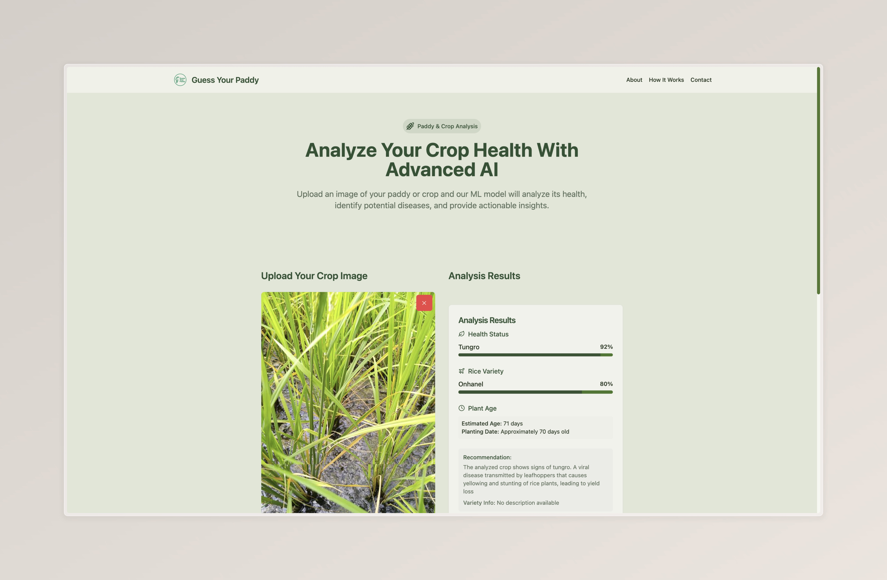

# 🌿 Guess Your Paddy – Web Interface


A user-friendly web application that demonstrates the functionality of the **Guess Your Paddy** AI system. It allows farmers, researchers, and agricultural stakeholders to:

- 🌾 Identify rice variety
- 🦠 Detect diseases such as Tungro
- 📅 Estimate the age of rice crops

Built from scratch using modern web technologies, this frontend is tightly integrated with our AI-powered backend that analyzes rice leaf images and returns actionable predictions to improve crop management and reduce yield loss.

🔗 **Live Site**: [guessyourpaddy.site](http://guessyourpaddy.site)

---

## 📸 Demo Preview



---

## 🚀 Quick Start (Local Development)

> You'll need **Node.js & npm**. Install via [nvm](https://github.com/nvm-sh/nvm#installing-and-updating) if needed.

```bash
# 1. Clone the repository
git clone <YOUR_GIT_URL>

# 2. Go into the project folder
cd <YOUR_PROJECT_NAME>

# 3. Install dependencies
npm install

# 4. Start the development server
npm run dev
```

## ✨ Features

- 📷 Upload rice leaf images for instant AI analysis
- 📊 Real-time results: disease, age, and variety
- 🧠 AI-driven backend integration
- 🌐 Fully responsive UI with modern design

## 🤝 Authors

- Ngo Van Tai ([Github](https://github.com/TaiVanNgo))
- Duong Minh Tri ([Github](https://github.com/TriDuong070803))
- Huynh Thai Duong ([Github](https://github.com/TDuong04))
- Huynh Tan Phat ([Github](https://github.com/phatgg221))
